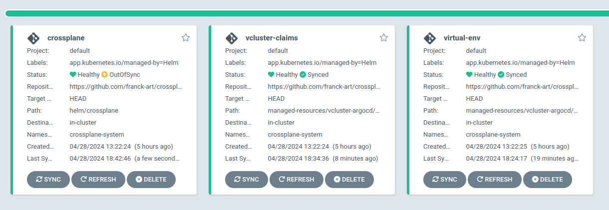

# Use Crossplane and Vcluster to build an ephemeral environment.
________________________________________________________________

## Architecture

## Prerequisites

* Kubernetes Cluster (I used for this Poc an GKE cluster)

* Helm


## Some crossplane resources


## Usage

1. Install Argocd and Crossplane

```
$ git clone https://github.com/franck-art/crossplane-project.git
$ cd helm/argcd
$ kubectl create ns argocd
$ helm install argocd . -n argocd
```
NB: Before installing argocd, make sure these lines are commented in the values.yaml files.

```
    extraObjects:
     - apiVersion: argoproj.io/v1alpha1
        kind: Application
        metadata:
          name: crossplane
        spec:
          destination:
            name: ''
            namespace: crossplane-system
            server: 'https://kubernetes.default.svc'
          source:
    ....
    ....
    ....
```

After installing Argocd, add these lines and apply again `helm upgrade argocd .  -n argocd `

Argocd will install three applications visible [here](https://github.com/franck-art/crossplane-project/blob/main/helm/argocd/values.yaml#L580):

* crossplane: to manage virtual env through vcluster. Path: helm/crossplane

* virtual-env: contains crossplane resources necessary to create a claim or compositeresource. Path: managed-resources/virtual-env

* claims: contains the claims users to create an isolated environment. Path: managed-resources/claims

2. Sync all resources
You can connect to Argo UI by exposing the service.

```
$ kubectl port-forward -n argocd svc/argocd-server 8080:443
Forwarding from 127.0.0.1:8080 -> 8080Forwarding from 127.0.0.1:8080 -> 8080
Forwarding from [::1]:8080 -> 8080
Forwarding from [::1]:8080 -> 8080
```

To log to the UI:

* username: admin
* password: admin1234



3. Check resources created and status of releases

```
kubectl get releases.helm.crossplane.io
kubectl describe releases.helm.crossplane.io RELEASE-NAME
```

If all resources are good, you will see all the vcluster pods in the host cluster.

**Example**
```
$ kubectl get pods -n dev2-env 
NAME                                                              READY   STATUS    RESTARTS   AGE
coredns-68bdd584b4-4w4s5-x-kube-system-x-dev2-env                 1/1     Running   0          50m
coredns-68bdd584b4-5x64n-x-kube-system-x-dev2-env-x--9aab637d42   1/1     Running   0          49m
dev2-env-0                                                        1/1     Running   0          51m
dev2-env-0-x-dev2-env-x-dev2-env                                  1/1     Running   0          49m
dev2-env-argocd-application-controller-0-x-argocd-x-dev2-env      1/1     Running   0          43m
dev2-env-argocd-applicationset-controller-74649ff6cc-e1037cd3b7   1/1     Running   0          43m
dev2-env-argocd-dex-server-76d8c9cbd7-7c4hh-x-argocd-x-dev2-env   1/1     Running   0          43m
dev2-env-argocd-notifications-controller-5554ccfc8d--07a3d76cf5   1/1     Running   0          43m
dev2-env-argocd-redis-ffdcf74f5-dl6vq-x-argocd-x-dev2-env         1/1     Running   0          43m
dev2-env-argocd-repo-server-5558c55c66-j6pt6-x-argoc-2e4571cbc6   1/1     Running   0          43m
dev2-env-argocd-server-78c484f45-bgq5p-x-argocd-x-dev2-env        1/1     Running   0          43m
vcluster-nginx-dev2-577d998768-qwzsm-x-nginx-x-dev2-env           1/1     Running   0          41m

```

4. Connect to dev2 argocd to see his environment

All the cresources created by vcluster are visible on the host cluster (pods, deployments, ...)

We will expose argocd UI.

```
$ kubectl port-forward -n dev2-env svc/dev2-env-argocd-server-x-argocd-x-dev2-env 4444:443
Forwarding from 127.0.0.1:4444 -> 8080
Forwarding from [::1]:4444 -> 8080
```


5. Check that app is availabled

Application installed in the virtual cluster is an nginx server, exposed through an Loadbalancer service type.


5. Create a claim to build a new env

Just add a new file in the claims directory which describe your environment.

```
managed-resources/vcluster-argocd/claims$ tree
.
├── dev1.yaml
├── dev2.yaml
└── dev3.yaml

0 directories, 3 files
```